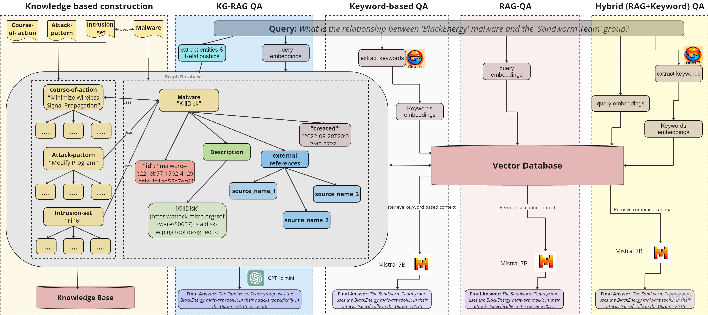
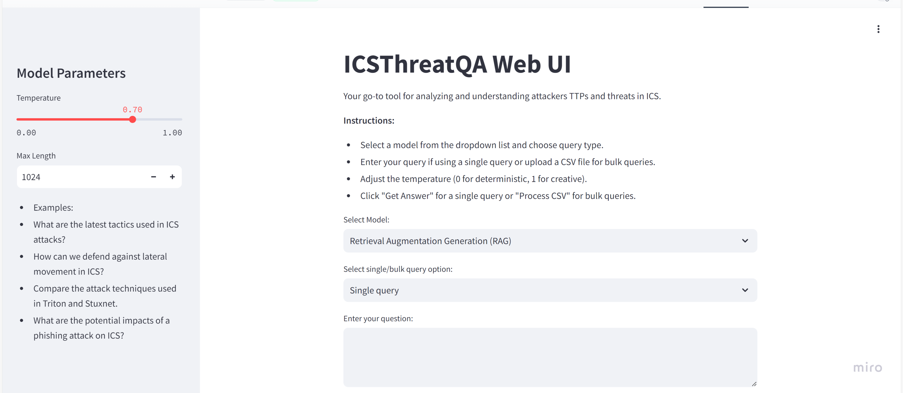

# ICSThreatQA: Knowledge-Graph Enhanced QA for ICS Threat Intelligence

<p align="center">
  
</p>

**ICSThreatQA** is a research-driven framework that transforms static ICS threat knowledge into an interactive, analyst-ready Question Answering (QA) system. Built around **[MITRE ATT&CK for ICS](https://attack.mitre.org/matrices/ics/)** knowledge base, it helps cybersecurity practitioners explore attacker TTPs, map events to techniques, and reason about threats using natural language queries instead of manual matrix navigation or document searching.

At its core, ICSThreatQA implements four complementary QA architectures: a standard Retrieval-Augmented Generation (RAG) model, a keyword-based retriever, a hybrid retriever that combines keyword and semantic search, and a Knowledge Graph–enhanced RAG (KG-RAG) that performs multi-hop reasoning over tactics, techniques, malware, mitigations, and assets. These models are evaluated on a curated [dataset of 620 expert-validated QA pairs](https://github.com/mahend72/ICSThreatQA-Dataset) specifically designed for ICS threat intelligence.

The repository includes a Streamlit-based web interface for single and batch queries, integration with open-source LLMs (e.g., Mistral-7B, Zephyr-7B), and OpenAI-powered KG-RAG via GPT-4o-mini. ICSThreatQA is intended for researchers, students, and security analysts who want to experiment with RAG pipelines, benchmark QA models in the ICS domain, or prototype decision-support tools for OT/ICS security operations.

## ✨ Key Features

- **ICS-focused QA**
  - Tailored to OT/ICS concepts: SCADA, PLCs, SIS, ICS malware, ATT&CK for ICS.

- **Four QA Architectures**
  - **Standard RAG** – Embedding-based semantic retrieval (vector DB).
  - **Keyword-Based RAG** – Keyword extraction + keyword-driven retrieval.
  - **Hybrid RAG** – Combines keyword + semantic retrieval for better precision/recall.
  - **KG-RAG** – Knowledge Graph–augmented RAG with multi-hop reasoning.

- **Analyst-Friendly Web UI**
  - Built with **Streamlit**.
  - Single query or **bulk CSV evaluation**.
  - Temperature & max token length controls.
  - Supports multiple model backends.

- **Multi-Model Backend**
  - **Mistral-7B** – core RAG answering model.
  - **Zephyr-7B** – keyword extraction for keyword & hybrid modes.
  - **GPT-4o-mini** – KG construction and KG-RAG reasoning (via OpenAI).
  - **SentenceTransformers + FAISS** – dense retrieval over ATT&CK data.

## 📊 Dataset

Dataset repository:  
👉 [https://github.com/mahend72/ICSThreatQA-Dataset](https://github.com/mahend72/ICSThreatQA-Dataset)

**Highlights:**

- 620 QA pairs, grounded in MITRE ATT&CK for ICS.
- Four query types: `Factual`, `Contrastive`, `Inferential`, `Opinion-based`
- Expert-reviewed ground truth answers.
- Suitable as a benchmark for ICS threat QA.

## 🌐 Live Demo

A live demo of ICSThreatQA is available at:

👉 https://huggingface.co/spaces/rubypnchl/KnowledgeMate  

Features:

- Select QA model (RAG / LLM / Keyword / Hybrid / KG-RAG).
- Single query or batch CSV input.
- Adjustable temperature and max token length.
- Visual answer and context display.

(Currently, the App is not working due to incompatibility; we are working on it.)


## ⚙️ Installation

> The exact filenames may differ (e.g. `app.py`, `icsthreatqa_app.py`). Adjust commands accordingly.

### 1. Clone the repo

```bash
git clone https://github.com/mahend72/ICSThreatQA.git
cd ICSThreatQA
```

### 2. Create a virtual environment (recommended)

```bash
python -m venv .venv
source .venv/bin/activate   # Windows: .venv\Scripts\activate
```

### 3. Install dependencies

If there is a `requirements.txt`:

```bash
pip install -r requirements.txt
```

### 4. Set API keys
```bash
# OpenAI (for GPT-4o-mini / KG-RAG)
export OPENAI_API_KEY="your_openai_api_key"

# Hugging Face (for Mistral, Zephyr, etc.)
export HUGGINGFACEHUB_API_TOKEN="your_hf_token"
```

## 🚀 Run the Web App
```bash
streamlit run app.py
```

<p align="center">
  
</p>


Then open the URL printed in the terminal (typically: `http://localhost:8501`).

## 🧵 Usage

### Single Query

1. Select a Model:
    - Retrieval Augmentation Generation (RAG)
    - Large Language Model (LLM)
    - Keyword-Based Retrieval
    - Combined Retrieval Method (Hybrid)
    - Knowledge Graph RAG
    - Online Learning-based KG RAG
2. Choose Single query.
3. Type your question (e.g.):
    - `What malware is associated with the 'Industroyer' attack?`
    - `Which group is known for using 'TRITON' malware?`
    - `How do Sandworm techniques differ from Lazarus Group?`
4. Click Get Answer.

The app will show zero-shot / few-shot answers and (where applicable) retrieved context.

### Bulk Queries (CSV)

1. Prepare a CSV with a column named questions.
2. Choose Bulk queries (CSV file).
3. Upload the CSV.
4. Select model/approach.
5. Click Process CSV.

The app will:

Run all questions through the selected model.

  - Add columns such as:
  - question_type
      - zero_shot_answers
      - few_shot_answers
      - zero_shot_contexts.

## 🧪 Evaluation (Summary)

ICSThreatQA is evaluated using:

- **RAGAS metrics**: `Faithfulness`, `Answer Relevance`, `Context Precision/Recall`, `Context Relevancy`, `Context Entity Recall`, `Answer Semantic Similarity`, `Answer Correctness`
- **Other metrics**: `BLEU-4`, `ROUGE-L`, `Human expert ratings (usefulness, completeness, trustworthiness)`


## 📚 Citation

If you use ICSThreatQA or the ICSThreatQA dataset in your research, please cite the paper:

```bash
@article{rani2025icsthreatqa,
  title   = {ICSThreatQA: A Knowledge-Graph Enhanced Question Answering Model for Industrial Control System Threat Intelligence},
  author  = {Rani, Ruby and Kumar, Mahender and Epiphaniou, Gregory and Maple, Carsten},
  journal = {Elsevier Expert Systems with Applications},
  year    = {2025}
}
```

## Contributor 
  - [Ruby Rani](https://scholar.google.com/citations?hl=en&user=oNb02okAAAAJ&view_op=list_works)
  - [Mahender Kumar](https://scholar.google.com/citations?user=Ppmct6EAAAAJ&hl=en)
  - [Gregory Epiphaniou](https://warwick.ac.uk/fac/sci/wmg/about/our-people/profile/?wmgid=2175)
  - [Carsten Maple](https://warwick.ac.uk/fac/sci/wmg/about/our-people/profile/?wmgid=1102)

## Acknowledgements

> This work is supported by the Engineering and Physical Sciences Research Council (EPSRC) through project EP/V051040/1, “Responsive Additive Manufacturing to Overcome Natural and Attack-based Disruption.”
